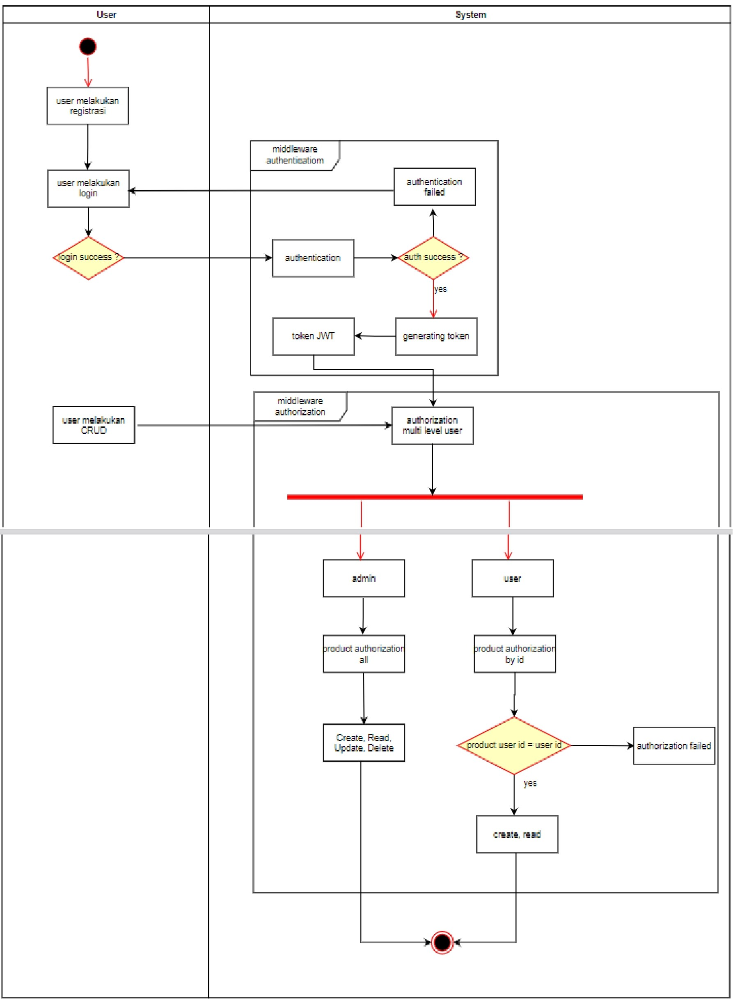
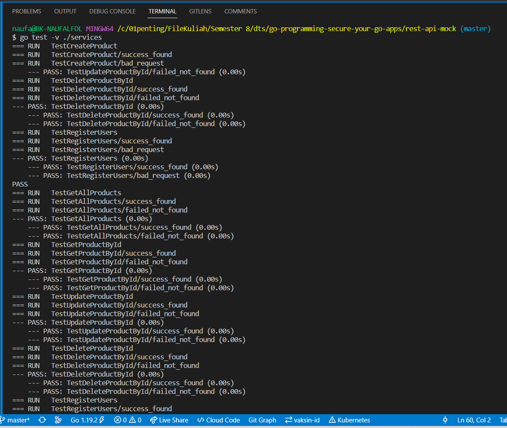

# Challange 10

This is a program for add a product with user authentication and authorization. Program already use **DDD (Domain Driven Design)**.
This include some of function **unit test with testify/mock**.

## Diagram Activity
Here the Diagram Activity:

## For the output

1. Git clone first
2. Set your .env
3. Set your database (postgresql)
4. Look after the postman file: [Postman-output](https://github.com/naufal360/go-middleware-challange/blob/master/assets/Midleware-Challange.postman_collection.json)
5. Import the postman file to your postman.
6. Expand each folder and request to see the each example output.

## Run Program
How to run program:

    // after all set, just run command below
    `go run main.go`

## Run Test
How to run test:
    
    `go test -v ./services`

## Result Test
*GetAllProduct* and *GetProductById*

